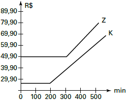
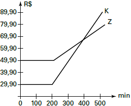
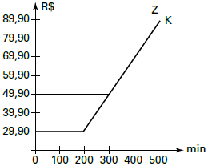
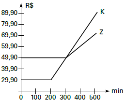
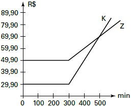

# q
     Uma empresa de telefonia fixa oferece dois planos aos seus clientes: no plano K, o cliente paga R$ 29,90 por 200 minutos mensais e R$ 0,20 por cada minuto excedente; no plano Z, paga R$ 49,90 por 300 minutos mensais e R$ 0,10 por cada minuto excedente.

O gráfico que representa o valor pago, em reais, nos dois planos em função dos minutos utilizados é

# a

# b

# c

# d

# e

# r
d

# s
Do enunciado, temos:

Plano K:\
Para x impulsos, temos:

$K(x) =$ $29 ,90 \\, se\\, 0 \leq x \leq 200$\
         $0,20x + 29,90 \\, se \\,x>200$

Plano Z:\
Para x impulsos, temos:

$Z(x) =$ $49,90\\, se\\, 0 \leq x \leq 300$\
            $0,10x + 49,90 \\, se\\, x > 300$

O gráfico que representa o valor pago, em reais, nos dois planos, em função dos minutos utilizados, é da alternativa **D**.
