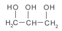
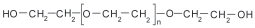
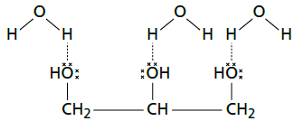

# q
     A pele humana, quando está bem hidratada, adquire boa elasticidade e aspecto macio e suave. Em contrapartida, quando está ressecada, perde sua elasticidade e se apresenta opaca e áspera. Para evitar o ressecamento da pele é necessário, sempre que possível, utilizar hidratantes umectantes, feitos geralmente à base de glicerina e polietilenoglicol:

\
glicerina

\
polietilenoglicol

Disponível em: http://www.brasilescola.com. Acesso em: 23 abr. 2010 (adaptado).

A retenção de água na superfície da pele promovida pelos hidratantes é consequência da interação dos grupos hidroxila dos agentes umectantes com a umidade contida no ambiente por meio de

# a
ligações iônicas.

# b
forças de London.

# c
ligações covalentes.

# d
forças dipolo-dipolo.

# e
ligações de hidrogênio.

# r
e

# s
A retenção de água na superfície da pele, promovida pela glicerina e pelo polietilenoglicol, ocorre por meio de ligações de hidrogênio com a água, como esquematizado abaixo:

