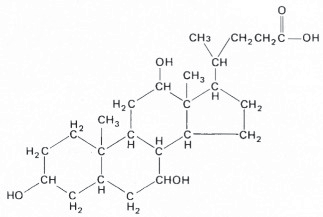
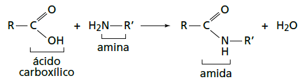

# q
     A bile é produzida pelo fígado, armazenada na vesícula biliar e tem papel fundamental na digestão de lipídeos. Os sais biliares são esteroides sintetizados no fígado a partir do colesterol, e sua rota de síntese envolve várias etapas. Partindo do ácido cólico representado na figura, ocorre a formação dos ácidos glicocólico e taurocólico; o prefixo glico- significa a presença de um resíduo do aminoácido glicina e o prefixo tauro-, do aminoácido taurina.

\
ácido cólico

UCKO, D. A.** Química para as Ciências da Saúde:** uma Introdução à Química Geral,\
 Orgânica e Biológica. São Paulo: Manole,1992 (adaptado).

A combinação entre o ácido cólico e a glicina ou taurina origina a função amida, formada pela reação entre o grupo amina desses aminoácidos e o grupo

# a
carboxila do ácido cólico.

# b
aldeído do ácido cólico.

# c
hidroxila do ácido cólico.

# d
cetona do ácido cólico.

# e
éster do ácido cólico.

# r
a

# s
A função amida pode ser obtida pela reação entre um ácido carboxílico e uma amina, como esquematizado abaixo:

Sendo assim, a função amida será obtida pela reação do grupo amino da glicina ou taurina com o grupo carboxila do ácido cólico.
