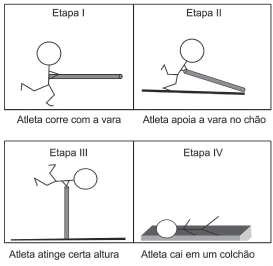

# q
     Uma das modalidades presentes nas olimpíadas é o salto com vara. As etapas de um dos saltos de um atleta estão representadas na figura:

Desprezando-se as forças dissipativas (resistência do ar e atrito), para que o salto atinja a maior altura possível, ou seja, o máximo de energia seja conservada, é necessário que

# a
a energia cinética, representada na etapa I, seja totalmente convertida em energia potencial elástica representada na etapa IV.

# b
a energia cinética, representada na etapa II, seja totalmente convertida em energia potencial gravitacional, representada na etapa IV.

# c
a energia cinética, representada na etapa I, seja totalmente convertida em energia potencial gravitacional, representada na etapa III.

# d
a energia potencial gravitacional, representada na etapa II, seja totalmente convertida em energia potencial elástica, representada na etapa IV.

# e
a energia potencial gravitacional, representada na etapa I, seja totalmente convertida em energia potencial elástica, representada na etapa III.

# r
c

# s
Para que exista maior aproveitamento de energia mecânica, toda a energia cinética da etapa I deverá ser convertida em energia potencial gravitacional da etapa III.
