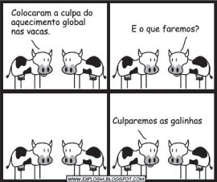

# q

De acordo com o relatório “A grande sombra da pecuária” (Livestock’s Long Shadow), feito pela Organização das Nações Unidas para a Agricultura e a Alimentação, o gado é responsável por cerca de 18% do aquecimento global, uma contribuição maior que a do setor de transportes.

Disponível em: www.conpet.gov.br. Acesso em: 22 jun. 2010.

A criação de gado em larga escala contribui para o aquecimento global por meio da emissão de

# a
metano durante o processo de digestão.

# b
óxido nitroso durante o processo de ruminação.

# c
clorofluorcarbono durante o transporte de carne.

# d
óxido nitroso durante o processo respiratório.

# e
dióxido de enxofre durante o consumo de pastagens.

# r
a

# s
Na digestão que ocorre no organismo do gado, há produção de $\ce{CH4}$, substância que agrava significativamente o efeito estufa.
