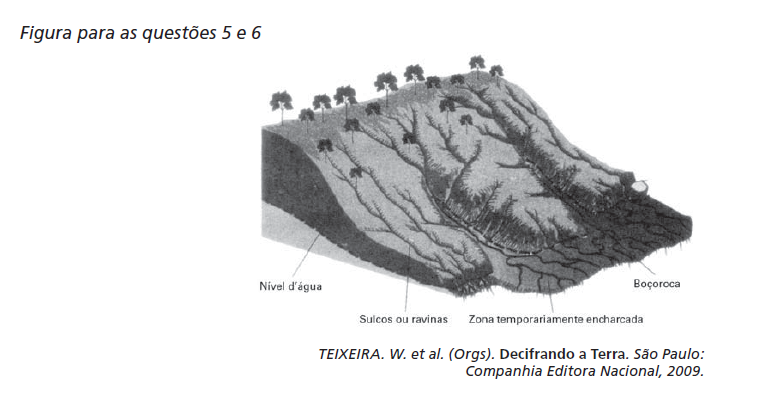

# q

O esquema representa um processo de erosão em encosta. Que prática realizada por um agricultor pode resultar em aceleração desse processo?

# a
Plantio direto.

# b
Associação de culturas.

# c
Implantação de curvas de nível.

# d
Aração do solo, do topo ao vale.

# e
Terraceamento na propriedade.

# r
d

# s
A prática da aração dos solos em áreas de encostas, dos topos até os vales, torna-os mais suscetíveis às intempéries da natureza, pois essa ação desagrega as partículas que os compõem, potencializando os processos de erosão nessas áreas.
