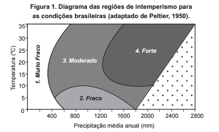
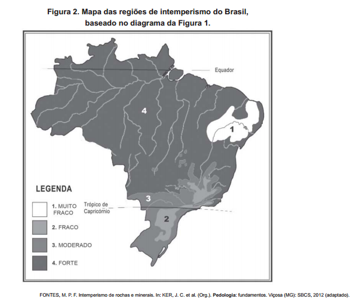

# q

De acordo com as figuras, a intensidade de intemperismo de grau muito fraco é característica de qual tipo climático?

# a
Tropical.

# b
Litorâneo.

# c
Equatorial.

# d
Semiárido.

# e
Subtropical.

# r
d

# s
A figura 1 demonstra que, quanto menores as temperaturas e, principalmente, a pluviosidade, menor será o grau de degradação trazido pelo intemperismo. Assim, o ambiente semiárido, característico do Sertão do Nordeste brasileiro, com baixos índices pluviométricos, apresentará o menor grau de degradação entre os ambientes do País.
