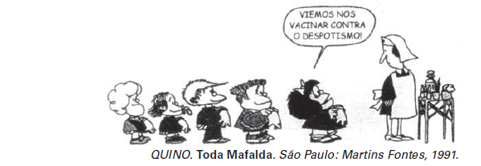

# q

Democracia: “regime político no qual a soberania é exercida pelo povo, pertence ao conjunto dos cidadãos.”

JAPIASSÚ, H.; MARCONDES, D. Dicionário Básico de Filosofi a. Rio de Janeiro: Zahar, 2006.

Uma suposta “vacina” contra o despotismo, em um contexto democrático, tem por objetivo

# a
impedir a contratação de familiares para o serviço público.

# b
reduzir a ação das instituições constitucionais.

# c
combater a distribuição equilibrada de poder.

# d
evitar a escolha de governantes autoritários.

# e
restringir a atuação do Parlamento.

# r
d

# s
Analisando as alternativas, a única que identifica uma forma de evitar o despotismo — a partir de um ambiente democrático — é aquela que cita a rejeição a governantes autoritários.
