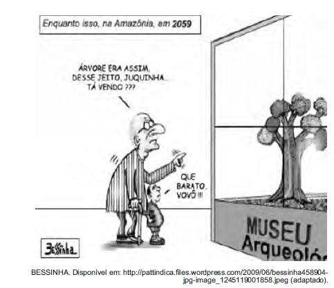

# q

As diferentes esferas sociais de uso da língua obrigam o falante a adaptá-la às variadas situações de comunicação. Uma das marcas linguísticas que configuram a linguagem oral informal usada entre avô e neto neste texto é

# a
a opção pelo emprego da forma verbal “era” em lugar de “foi”.

# b
a ausência de artigo antes da palavra “árvore”.

# c
o emprego da redução “tá” em lugar da forma verbal “está”.

# d
o uso da contração “desse” em lugar da expressão “de esse”.

# e
a utilização do pronome “que” em início de frase exclamativa.

# r
c

# s
“Tá”, por “está”, é redução típica do coloquial brasileiro, de uso geral no país.
