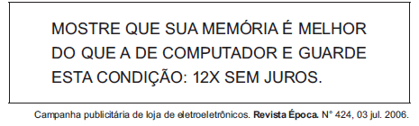

Ao circularem socialmente, os textos realizam-se como práticas de linguagem, assumindo configurações específicas, formais e de conteúdo. Considerando o contexto em que circula o texto publicitário, seu objetivo básico é

- [x] influenciar o comportamento do leitor, por meio de apelos que visam à adesão ao consumo.
- [ ] definir regras de comportamento social pautadas no combate ao consumismo exagerado.
- [ ] defender a importância do conhecimento de informática pela população de baixo poder aquisitivo.
- [ ] facilitar o uso de equipamentos de informática pelas classes sociais economicamente desfavorecidas.
- [ ] questionar o fato de o homem ser mais inteligente que a máquina, mesmo a mais moderna.

Trata-se do emprego da linguagem em sua função conativa, que visa a “influenciar o comportamento do leitor”.
