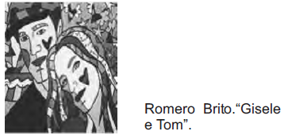
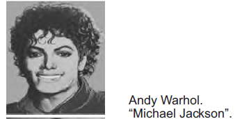
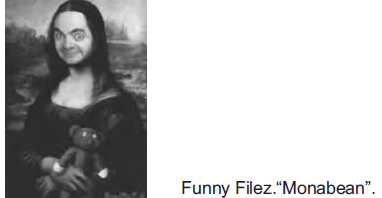

Na busca constante pela sua evolução, o ser humano vem alternando a sua maneira de pensar, de sentir e de criar. Nas últimas décadas do século XVIII e no início do século XIX, os artistas criaram obras em que predominam o equilíbrio e a simetria de formas e cores, imprimindo um estilo caracterizado pela imagem da respeitabilidade, da sobriedade, do concreto e do civismo. Esses artistas misturaram o passado ao presente, retratando os personagens da nobreza e da burguesia, além de cenas míticas e histórias cheias de vigor.

RAZOUK, J. J. (Org.). Histórias reais e belas nas telas. Posigraf: 2003.

Atualmente, os artistas apropriam-se de desenhos, charges, grafismo e até de ilustrações de livros para compor obras em que se misturam personagens de diferentes épocas, como na seguinte imagem:

- [ ] 
- [ ] 
- [x] 
- [ ] 
- [ ] 

A imagem de Funny Filez mistura “personagens de diferentes épocas”: a Mona Lisa e Mr. Bean, popular personagem cômica da televisão.

        