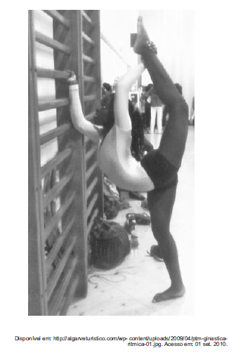

# q

O desenvolvimento das capacidades físicas (qualidades motoras passíveis de treinamento) ajuda na tomada de decisões em relação à melhor execução do movimento. A capacidade física predominante no movimento representado na imagem é

# a
a velocidade, que permite ao músculo executar uma sucessão rápida de gestos em movimentação de intensidade máxima.

# b
a resistência, que admite a realização de movimentos durante considerável período de tempo, sem perda da qualidade da execução.

# c
a flexibilidade, que permite a amplitude máxima de um movimento, em uma ou mais articulações, sem causar lesões.

# d
a agilidade, que possibilita a execução de movimentos rápidos e ligeiros com mudanças de direção.

# e
o equilíbrio, que permite a realização dos mais variados movimentos, com o objetivo de sustentar o corpo sobre uma base.

# r
c

# s
Trata-se de um exercício de alongamento muscular, que visa a obter “a amplitude máxima de um movimento”.
