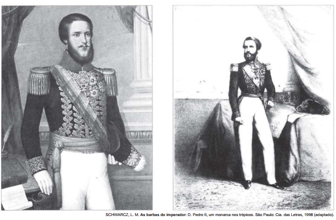

Essas imagens de D. Pedro II foram feitas no início dos anos de 1850, pouco mais de uma década após o Golpe da Maioridade. Considerando o contexto histórico em que foram produzidas e os elementos simbólicos destacados, essas imagens representavam um

- [ ] jovem maduro que agiria de forma irresponsável.
- [x] imperador adulto que governaria segundo as leis.
- [ ] líder guerreiro que comandaria as vitórias militares.
- [ ] soberano religioso que acataria a autoridade papal.
- [ ] monarca absolutista que exerceria seu autoritarismo.

As ilustrações de D. Pedro II, retratado no início do Segundo Reinado – portanto após um prolongado período de agitações e lutas internas – procuravam construir a imagem de um monarca equilibrado, seguro e respeitador das leis; ou seja, o governante ideal para o momento vivido pelo Brasil. Observe-se que a indumentária do imperador nas gravuras apresentadas se relaciona com sua posição hierárquica de chefe de Estado.
