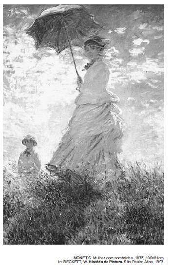

Em busca de maior naturalismo em suas obras e fundamentando-se em novo conceito estético, Monet, Degas, Renoir e outros artistas passaram a explorar novas formas de composição artística, que resultaram no estilo denominado Impressionismo. Observadores atentos da natureza, esses artistas passaram a

- [ ] retratar, em suas obras, as cores que idealizavam de acordo com o reflexo da luz solar nos objetos.
- [ ] usar mais a cor preta, fazendo contornos nítidos, que melhor definiam as imagens e as cores do objeto representado.
- [ ] retratar paisagens em diferentes horas do dia, recriando, em suas telas, as imagens por eles idealizadas.
- [x] usar pinceladas rápidas de cores puras e dissociadas diretamente na tela, sem misturá-las antes na paleta.
- [ ] usar as sombras em tons de cinza e preto e com efeitos esfumaçados, tal como eram realizadas no Renascimento.

A alternativa d descreve o procedimento inovador empregado pelos pintores impressionistas. Na alternativa a, está errada a qualificação “idealizadas” para as cores da pintura impressionista. Também não era apenas o efeito da “luz solar” que esses pintores buscavam reproduzir
