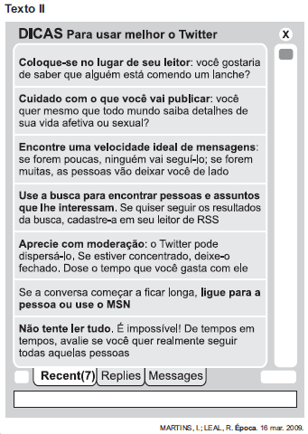

# q
Texto I

Sob o olhar do Twitter

Vivemos a era da exposição e do compartilhamento. Público e privado começam a se confundir. A ideia de privacidade vai mudar ou desaparecer.

O trecho acima tem 140 caracteres exatos. É uma mensagem curta que tenta encapsular uma ideia complexa. Não é fácil esse tipo de síntese, mas dezenas de milhões de pessoas o praticam diariamente. No mundo todo, são disparados 2,4 trilhões de SMS por mês, e neles cabem 140 toques, ou pouco mais. Também é comum enviar e-mails, deixar recados no Orkut, falar com as pessoas pelo MSN, tagarelar no celular, receber chamados em qualquer parte, a qualquer hora. Estamos conectados. Superconectados, na verdade, de várias formas.

\[...] O mais recente exemplo de demanda por total conexão e de uma nova sintaxe social é o Twitter, o novo serviço de troca de mensagens pela internet. O Twitter pode ser entendido como uma mistura de blog e celular. As mensagens são de 140 toques, como os torpedos dos celulares, mas circulam pela internet, como os textos de blogs. Em vez de seguir para apenas uma pessoa, como no celular ou no MSN, a mensagem do Twitter vai para todos os “seguidores” – gente que acompanha o emissor. Podem ser 30, 300 ou 409 mil seguidores.

MARTINS, I; LEAL, R. Época. 16 mar. 2009 (fragmento adaptado).

Da comparação entre os textos, depreende-se que o texto II constitui um passo a passo para interferir no comportamento dos usuários, dirigindo-se diretamente aos leitores, e o texto I

# a
adverte os leitores de que a internet pode transformar-se em um problema porque expõe a vida dos usuários e, por isso, precisa ser investigada.

# b
ensina aos leitores os procedimentos necessários para que as pessoas conheçam, em profundidade, os principais meios de comunicação da atualidade.

# c
exemplifica e explica o novo serviço global de mensagens rápidas que desafia os hábitos de comunicação e reinventa o conceito de privacidade.

# d
procura esclarecer os leitores a respeito dos perigos que o uso do Twitter pode representar nas relações de trabalho e também no plano pessoal.

# e
apresenta uma enquete sobre as redes sociais mais usadas na atualidade e mostra que o Twitter é preferido entre a maioria dos internautas.

# r
c

# s
A partir da exemplificação presente na introdução do texto, o autor relaciona uma série de meios de comunicação que são realizados por mensagens rápidas, como o SMS e o Twitter. Nesse novo universo de relações, “público e privado começam a se confundir”, o que resulta, nos termos da alternativa c, numa “reinvenção” do conceito de privacidade.
