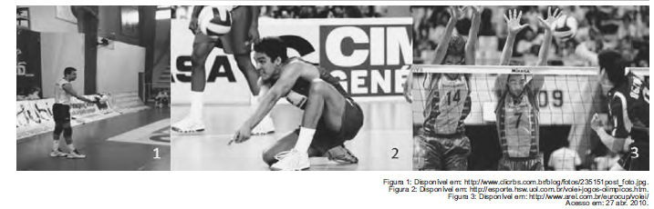

O voleibol é um dos esportes mais praticados na atualidade. Está presente nas competições esportivas, nos jogos escolares e na recreação, Nesse esporte, os praticantes utilizam alguns movimentos específicos como: saque, manchete, bloqueio, levantamento, toque, entre outros. Na sequência de imagens, identificam-se os movimentos de

- [x] sacar e colocar a bola em jogo, defender a bola e realizar a cortada como forma de ataque.
- [ ] arremessar a bola, tocar para passar a bola ao levantador e bloquear como forma de ataque.
- [ ] tocar e colocar a bola em jogo, cortar para defender e levantar a bola para atacar.
- [ ] passar a bola e iniciar a partida, lançar a bola ao levantador e realizar a manchete para defender.
- [ ] cortar como forma de ataque, passar a bola para defender e bloquear como forma de ataque.

Na imagem número 1, o jogador prepara-se para sacar e colocar a bola em jogo. Na imagem número 2, o atleta, agachado, defende a bola. Na última imagem, o ângulo da foto é o da cortadora, atacando em cima do bloqueio.
