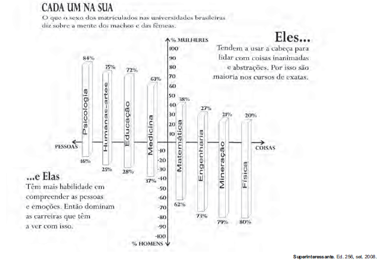

Segundo pesquisas recentes, é irrelevante a diferença entre sexos para se avaliar a inteligência. Com relação às tendências para áreas do conhecimento, por sexo, levando em conta a matrícula em cursos universitários brasileiros, as informações do gráfico asseguram que

- [ ] os homens estão matriculados em menor proporção em cursos de Matemática que em Medicina por lidarem melhor com pessoas.
- [x] as mulheres estão matriculadas em maior percentual em cursos que exigem capacidade de compreensão dos seres humanos.
- [ ] as mulheres estão matriculadas em percentual maior em Física que em Mineração por tenderem a trabalhar melhor com abstrações.
- [ ] os homens e as mulheres estão matriculados na mesma proporção em cursos que exigem habilidades semelhantes na mesma área.
- [ ] as mulheres estão matriculadas em menor número em Psicologia por sua habilidade de lidarem melhor com coisas que com sujeitos.

A partir da interpretação do gráfico e da leitura dos textos que o compõem, pode-se afirmar que há um percentual maior de mulheres nas carreiras que exigem a habilidade de lidar com pessoas e emoções.
