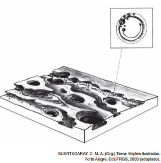

A imagem representa o resultado da erosão que ocorre em rochas nos leitos dos rios, que decorre do processo natural de

- [ ] fraturamento geológico, derivado da força dos agentes internos.
- [ ] solapamento de camadas de argilas, transportadas pela correnteza.
- [x] movimento circular de seixos e areias, arrastados por águas turbilhonares.
- [ ] decomposição das camadas sedimentares, resultante da alteração química.
- [ ] assoreamento no fundo do rio, proporcionado pela chegada de material sedimentar.

A figura mostra um fundo de vale com camadas sedimentares sujeitas a formas de erosão circulares, sugerindo a circulação da água de forma turbilhonante. Isso pode ser confirmado pela figura superior direita, que mostra a rotação das partículas que desencadearam o processo.
