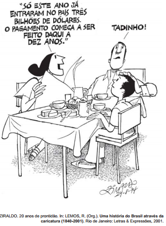

# q

No período de 1964 a 1985, a estratégia do Regime Militar abordada na charge foi caracterizada pela

# a
 priorização da segurança nacional.

# b
 captação de financiamentos estrangeiros.

# c
execução de cortes nos gastos públicos.

# d
 nacionalização de empresas multinacionais.

# e
 promoção de políticas de distribuição de renda.

# r
b

# s
A charge de Ziraldo faz referência à política econômica praticada pelo regime militar brasileiro, baseada na captação de grandes empréstimos externos, a serem pagos em prazos longos, comprometendo as gerações futuras. Deve-se porém observar que esse procedimento foi recorrente na época do “Milagre Brasileiro”, quando havia facilidade na obtenção de créditos internacionais. Todavia, o primeiro choque do petróleo (1973) e a consequente elevação dos juros internacionais, prejudicaram o fluxo de empréstimos para o Brasil, levando o País a solicitar uma moratória nos anos 80.
