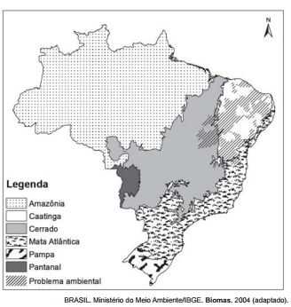

No mapa estão representados os biomas brasileiros que, em função de suas características físicas e do modo de ocupação do território, apresentam problemas ambientais distintos. Nesse sentido, o problema ambiental destacado no mapa indica

- [x] desertificação das áreas afetadas.
- [ ] poluição dos rios temporários.
- [ ] queimadas dos remanescentes vegetais.
- [ ] desmatamento das matas ciliares.
- [ ] contaminação das águas subterrâneas.

O mapa nos traz a distribuição dos biomas existentes ao longo do território brasileiro, distinguindo-os por meio da legenda. Há também o destaque de áreas que se estendem basicamente pela Região Nordeste do País, nas quais um problema ambiental se expande; ela possui em grande parte clima tropical semiárido, caracterizado por altas temperaturas e chuvas escassas e irregulares. Isso favorece a existência de uma vegetação adaptada a ambientes mais secos, a caatinga, que hoje corresponde a um dos biomas mais ameaçados do País em razão do intenso processo de desmatamento para exploração da madeira e para a prática da pecuária. Esse processo expõe os solos e provoca a diminuição gradativa da umidade no ambiente, levando à desertificação.
