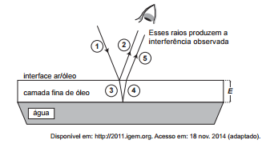

Certos tipos de superfícies na natureza podem refletir luz de forma a gerar um efeito de arco-íris. Essa característica é conhecida como iridescência e ocorre por causa do fenômeno da interferência de película fina. A figura ilustra o esquema de uma fina camada iridescente de óleo sobre uma poça d’água. Parte do feixe de luz branca incidente **1** reflete na interface ar/óleo e sofre inversão de fase **2**, o que equivale a uma mudança de meio comprimento de onda. A parte refratada do feixe **3** incide na interface óleo/água e sofre reflexão sem inversão de fase **4**.

O observador indicado enxergará aquela região do filme com coloração equivalente à do comprimento de onda que sofre interferência completamente construtiva entre os raios **2** e **5**, mas essa condição só é possível para uma espessura mínima da película. Considere que o caminho percorrido em **3** e **4** corresponde ao dobro da espessura ***E*** da película de óleo. 

Expressa em termos do comprimento de onda ($\lambda$), a espessura mínima é igual a

- [ ] $\cfrac{\lambda}{4}$
- [ ] $\cfrac{\lambda}{2}$
- [ ] $\cfrac{3\lambda}{4}$
- [ ] $\lambda$
- [ ] $2 \lambda$

Como a reflexão na interface óleo/água ocorreu sem inversão de fase (dado no texto) e a reflexão na interface ar/óleo ocorreu com inversão de fase (também dado no texto), isso implica uma defasagem de** **$\pi$ rad entre os raios **2** e **5**.

Por outro lado, há uma defasagem por diferença de caminhos entre os raios **2** e **5**.

O caminho do raio que penetra no óleo, e sofre reflexão na interface óleo/água, é mais extenso de uma distância ***2E***.

Para que ocorra interferência construtiva (reforço), a diferença de caminhos deve provocar uma outra defasagem de $\pi\\,rad$ e, portanto:

$2E = \cfrac{\lambda}{2}$

$E = \cfrac{\lambda}{4}$
