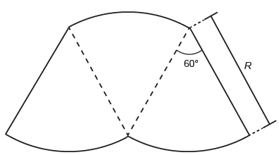

O proprietário de um parque aquático deseja construir uma piscina em suas dependências. A figura representa a vista superior dessa piscina, que é formada por três setores circulares idênticos, com ângulo central igual a 60°. O raio R deve ser um número natural.

O parque aquático já conta com uma piscina em formato retangular com dimensões 50 m x 24 m.\
O proprietário quer que a área ocupada pela nova piscina seja menor que a ocupada pela piscina já existente.

Considere 3,0 como aproximação para $\pi$.

O maior valor possível para R, em metros, deverá ser

- [ ] 16\.
- [x] 28\.
- [ ] 29\.
- [ ] 31\.
- [ ] 49\.

A área ocupada pela nova piscina deve ser menor que a ocupada pela piscina já existente, então:

$3 \cdot A\_{setor} < A\_{retângulo}$

$3 \cdot (\cfrac{60 \pi R^2}{360}) < 50 \cdot 24$

$3 \cdot \cfrac{1}{6}\cdot 3\cdot R^2 < 1200$

$R^2 < \cfrac{1200\cdot 6}{9}$

$R^2 < 800$

$R = 28$, uma vez que R tem que ser natural.

 
