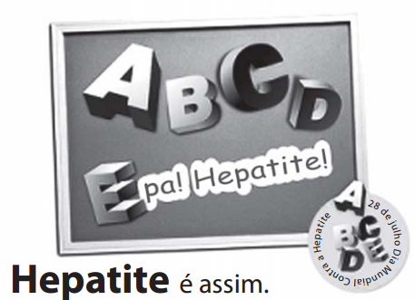

Pode aparecer onde menos se espera e em cinco formas diferentes. É por isso que o Dia Mundial Contra a Hepatite está aí para alertar você. As hepatites A, B, C, D e E têm diversas causas e muitas formas de chegar até você. Mas, evitar isso é bem simples. Você só precisa ficar atento aos cuidados necessários para cuidar do maior bem que você tem: A SUA SAÚDE!

Algumas maneiras de se prevenir:

• Vacine-se contra as hepatites A e B.\
• Use água tratada e siga sempre as recomendações quanto à restrição de banhos em locais públicos e ao uso de desinfetantes em piscinas.\
• Lave SEMPRE bem os alimentos como frutas, verduras e legume.\
• Lave SEMPRE bem as mãos após usar o toalete e antes de se alimentar.\
• Ao usar agulhas e seringas, certifique-se da higiene do local e de todos os acessórios.\
• Certifique-se de que seu médico ou profissional da saúde esteja usando a proteção necessária, como luvas e máscaras, quando houver a possibilidade de contato de sangue ou secreções contaminadas com o vírus.

Disponível em: http://farm5.static.flickr.com. Acesso em: 26 out. 2011 (adaptado)

 

Nas peças publicitárias, vários recursos verbais e não verbais são usados com o objetivo de atingir o público-alvo, influenciando seu comportamento. Considerando as informações verbais e não verbais trazidas no texto a respeito da hepatite, verifica-se que

- [ ] o tom lúdico é empregado como recurso de consolidação do pacto de confiança entre o médico e a população.
- [x] a figura do profissional da saúde é legitimada, evocando-se o discurso autorizado como estratégia argumentativa.
- [ ] o uso de construções coloquiais e específicas da oralidade são recursos de argumentação que simulam o discurso do médico.
- [ ] a empresa anunciada deixa de se autopromover ao mostrar preocupação social e assumir a responsabilidade pelas informações.
- [ ] o discurso evidencia uma cena de ensinamento didático, projetado com subjetividade no trecho sobre as maneiras de prevenção.

A peça publicitária apresenta a imagem de uma médica (o que se percebe pelo avental e pelo estetoscópio) ao lado de um conjunto de orientações de prevenção à hepatite. A presença dessa profissional constitui um argumento de autoridade, tornando confiável o discurso veiculado.
