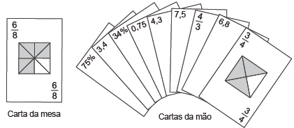

No contexto da matemática recreativa, utilizando diversos materiais didáticos para motivar seus alunos, uma professora organizou um jogo com um tipo de baralho modificado, No início do jogo, vira-se uma carta do baralho na mesa e cada jogador recebe em mãos nove cartas. Deseja-se formar pares de cartas, sendo a primeira carta a da mesa e a segunda, uma carta na mão do jogador, que tenha um valor equivalente àquele descrito na carta da mesa. O objetivo do jogo é verificar qual jogador consegue o maior número de pares. Iniciado o jogo, a carta virada na mesa e as cartas da mão de um jogador são como no esquema:

Segundo as regras do jogo, quantas cartas da mão desse jogador podem formar um par com a carta da mesa?

- [ ] 9
- [ ] 7
- [ ] 5
- [ ] 4
- [x] 3

 Analisamos que a fração da carta da mesa é de $\cfrac{6}{8}$ = $\cfrac{3}{4}$ = 0,75, e não $\cfrac{8}{9}$.

Analisando as cartas da mão do jogador, vimos que temos 3 cartas equivalentes.
