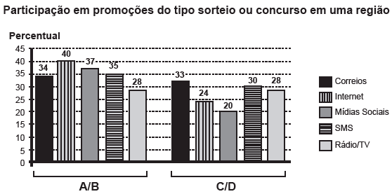

Uma pesquisa de mercado foi realizada entre os consumidores das classes sociais A, B, C e D que costumam participar de promoções tipo sorteio ou concurso. Os dados comparativos, expressos no gráfico, revelam a participação desses consumidores em cinco categorias: via Correios (juntando embalagens ou recortando códigos de barra), via internet (cadastrando-se no site da empresa/marca promotora), via mídias sociais (redes sociais), via SMS (mensagem por celular) ou via rádio/Tv.

Uma empresa vai lançar uma promoção utilizando apenas uma categoria nas classes A e B (A/B) e uma categoria nas classes C e D (C/D).

De acordo com o resultado da pesquisa, para atingir o maior número de consumidores das classes A/B e C/D, a empresa deve realizar a promoção, respectivamente, via

- [ ] Correios e SMS.
- [x] internet e Correios.
- [ ] internet e internet.
- [ ] internet e mídias sociais.
- [ ] rádio/TV e rádio/TV.

De acordo com o gráfico, o maior número de consu - midores das classes A/B que participam de promoções, utilizam a internet, e o maior número de consumidores das classes C/D que participam de promoções, utilizam os correios.
