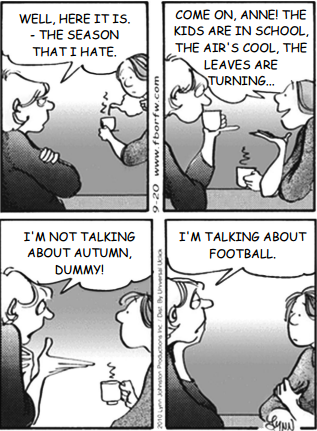

**Monday September 20, 2010**

Na tira da série* For better or for worse*, a comunicação entre as personagens fica comprometida em um determinado momento porque

- [ ] as duas amigas divergem de opinião sobre futebol.
- [ ] uma das amigas desconsidera as preferências da outra.
- [ ] uma das amigas ignora que o outono é temporada de futebol.
- [ ] uma das amigas desconhece a razão pela qual a outra a maltrata.
- [x] as duas amigas atribuem sentidos diferentes à palavra season.

\- Bem, aqui está a estação que eu odeio.\
\- Como assim, Anne! As crianças estão na escola, o ar é fresco, as folhas estão mudando de cor...\
\- Eu não estou falando do outono, boba! Estou falando do futebol.

**a)** **Incorreta.** Somente a primeira amiga está falando sua opinião sobre futebol.

**b)** **Incorreta.** Em nenhum momento pode-se dizer que alguma das amigas desconsidera as preferências da outra. Elas falam sobre suas preferências, em relação à época do ano e ao futebol.

**c) Incorreta.** Não podemos dizer que ela ignora que o outono é a temporada de futebol. É fato que, quando a amiga usou a palavra “season”, que pode ser estação do ano e temporada de esportes, ela apenas pensou no uso da palavra como estação do ano.

**d) Incorreta.** Não podemos dizer que uma maltrata a outra. É fato que uma delas odeia a temporada de futebol chama a outra de “boba” por não ter entendido que estava se referindo a season de temporada do futebol e não season da estação outono.

**e) Correta. **Podemos perceber que até que o mal-entendido seja desfeito, as duas estão interpretando a palavra “season” de duas formas diferentes, que pode ser estação do ano e temporada de esportes, para comunicar coisas diferentes. Enquanto a primeira amiga usa a palavra para falar que odeia a temporada dos esportes, a segunda amiga não entende porque ela apenas pensou no uso da palavra como estação do ano.

        