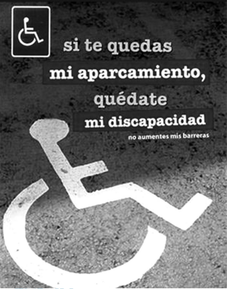

Disponível em: www.lacronicadeleon.es.
Acesso em: 12 mar. 2012 (adaptado).

A acessibilidade é um tema de relevância tanto na esfera pública quanto na esfera privada. No cartaz, a exploração desse tema destaca a importância de se

- [ ] estimular os cadeirantes na superação de barreiras.
- [x] respeitar o estacionamento destinado a cadeirantes.
- [ ] identificar as vagas reservadas aos cadeirantes.
- [ ] eliminar os obstáculos para o trânsito de cadeirantes.
- [ ] facilitar a locomoção de cadeirantes em estaciona - mentos.

A tradução do cartaz seria: “Se você fica com minha vaga, fique também com minha deficiência não aumente minhas barreiras”.
