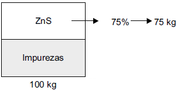

Para proteger estruturas de aço da corrosão, a indústria utiliza uma técnica chamada galvanização. Um metal bastante utilizado nesse processo é o zinco, que pode ser obtido a partir de um minério denominado esfalerita ($\ce{Zn}$), de pureza 75%. Considere que a conversão do minério em zinco metálico tem rendimento de 80% nesta sequência de equações químicas:

$\ce{2 ZnS + 3 O2 -> 2 ZnO + 2 SO2}$\
$\ce{ZnO + CO -> Zn + CO2}$

Considere as massas molares: $\ce{ZnS}$ (97 g/mol); $\ce{O2}$ (32 g/mol); $\ce{ZnO}$ (81 g/mol); $\ce{SO2}$ (64 g/mol); $\ce{CO}$ (28 g/mol); $\ce{CO2}$ (44 g/mol); e $\ce{Zn}$ (65 g/mol). Que valor mais proximo de massa de zinco metálico, em quilogramas, será produzido a partir de 100 kg de esfalerita?

- [ ] 25
- [ ] 33
- [x] 40
- [ ] 50
- [ ] 54

Cálculo da massa de ZnS na amostra:

Cálculo da massa de Zn com rendimento de 80%:

$\ce{2 ZnS + 3 O2 → 2 ZnO + 2 SO2}$\
$\ce{2 ZnO + 2 CO → 2 Zn + 2 CO2}$\
–––––––––––––––––––––––––––––––––––––––––\
$\ce{2 ZnS + 3 O2 + 2 CO ->2 Zn + 2 SO2 + 2 CO2}$

2 mol          2 mol (rendimento 100%)\
2 mol          0,8 x 2 mol (rendimento 80%)

2 x 97 g ––––––––––––– 0,8 x 2 x 65 g\
75 kg     ––––––––––––– x

x = 40,2 kg

O valor mais próximo é 40 kg.

        