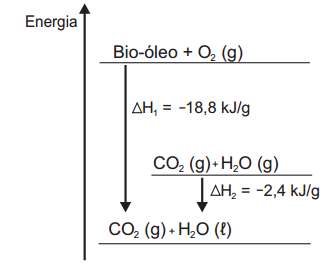

# q
O aproveitamento de resíduos florestais vem se tornando cada dia mais atrativo, pois eles são uma fonte renovável de energia. A figura representa a queima de um bio-óleo extraído do resíduo de madeira, sendo $\Delta H\_1$ a variação de entalpia devido à queima de 1 g desse bio-óleo, resultando em gás carbônico e água líquida, e $\Delta H\_2$, a variação de entalpia envolvida na conversão de 1 g de água no estado gasoso para o estado líquido.

A variação de entalpia, em kJ, para a queima de 5 g desse bio-óleo resultando em $\ce{CO2}$ (gasoso) e $\ce{H2O}$(gasoso) é:

# a
–106.

# b
–94,0.

# c
–82,0.

# d
–21,2.

# e
–16,4.

# r
c

# s
Pelo gráfico:

$\Delta H\_3$ = –18,8kJ/g + 2,4 kJ/g = –16,4kJ/g

$\ce{Bio + O2 (g) → CO2 (g) + H2O (g)}$    $\Delta H\_3 = -16,4\\,kJ/g$

1 g de bio-óleo ----   -16,4 kJ\
5 g de bio-óleo ----   x

x = –82 kJ
