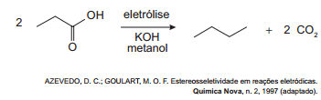
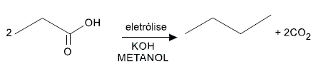
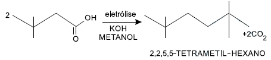

Hidrocarbonetos podem ser obtidos em laboratório por descarboxilação oxidativa anódica, processo conhecido como eletrossíntese de Kolbe. Essa reação é utilizada na síntese de hidrocarbonetos diversos, a partir de óleos vege tais, os quais podem ser empregados como fontes alter nativas de energia, em substituição aos hidrocarbonetos fósseis. O esquema ilustra simplificadamente esse processo.

Com base nesse processo, o hidrocarboneto produzido na eletrólise do ácido 3,3-dimetil-butanoico é o

- [ ] 2,2,7,7 -tetrametil-octano.
- [ ] 3,3,4,4-tetrametil-hexano.
- [x] 2,2,5,5-tetrametil-hexano.
- [ ] 3,3,6,6-tetrametil-octano.
- [ ] 2,2,4,4-tetrametil-hexano.

Hidrocarbonetos podem ser obtidos por descarboxilação oxidativa anódica, segundo a reação:

Com base nesse processo, o hidrocarboneto produzido na eletrólise do ácido 3,3 – dimetilbutanoico é:

 
