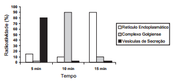
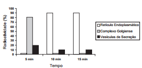
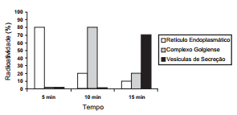
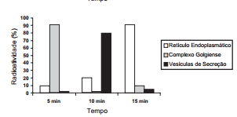
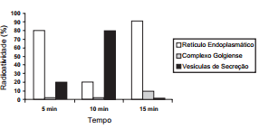

Muitos estudos de síntese e endereçamento de proteínas utilizam aminoácidos marcados radioativamente para acompanhar as proteínas, desde fases iniciais de sua produção até seu destino final. Esses ensaios foram muito empregados para estudo e caracterização de células secretoras.

Após esses ensaios de radioatividade, qual gráfico representa a evolução temporal da produção de proteínas e sua localização em uma célula secretora?

- [ ] 
- [ ] 
- [x] 
- [ ] 
- [ ] 

A aplicação de aminoácidos marcados radioati - vamente em células secretoras de proteínas permite acompanhar essas moléculas desde sua síntese no retículo endoplasmático rugoso (5 min); o transporte e concentração no complexo golgiense (10 min) e sua embalagem em vesículas de secreção (15 min). O gráfico que mostra a evolução temporal e a localização das proteínas marcadas em uma célula secretora está relacionado na alternativa c.
