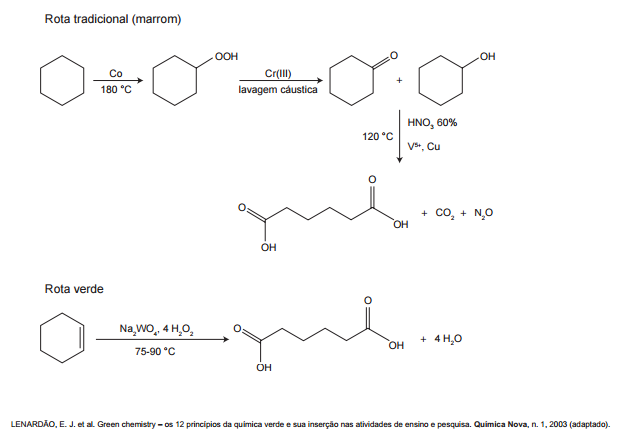

A química verde permite o desenvolvimento tecnológico com danos reduzidos ao meio ambiente, e encontrar rotas limpas tem sido um grande desafio. Considere duas rotas diferentes utilizadas para a obtenção de ácido adípico, um insumo muito importante para a indústria têxtil e de plastificantes.

Que fator contribui positivamente para que a segunda rota de síntese seja verde em comparação à primeira?

- [x] Etapa única na síntese.
- [ ] Obtenção do produto puro.
- [ ] Ausência de reagentes oxidantes.
- [ ] Ausência de elementos metálicos no processo.
- [ ] Gasto de energia nulo na separação do produto.

• A química verde permite o desenvolvimento tecnológico com danos reduzidos ao meio ambiente.

• Três fatores muito importantes a serem considerados são:

– Uso de fontes renováveis ou recicláveis.

– Aumento da eficiência de energia ou utilização de menos energia para produzir a mesma ou maior quantidade de produto.

– Evitar o uso de substâncias persistentes, bioacumulativas e tóxicas.

O fator que contribui positivamente para que a segunda rota de síntese, seja verde em comparação à primeira é ocorrer em uma única etapa. A temperatura necessária para a ocorrência da segunda reação é inferior, não gera subproduto tóxico e não utiliza substância corrosiva no processo.

• A redução do tempo total da reação, ocorrência de uma única etapa, é um fator importante que diferencia o primeiro processo (marrom) do segundo (verde).
