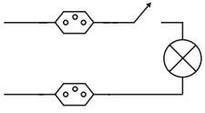

Um estudante, precisando instalar um computador, um monitor e uma lâmpada em seu quarto, verificou que precisaria fazer a instalação de duas tomadas e um interruptor na rede elétrica. Decidiu esboçar com antecedência o esquema elétrico. “O circuito deve ser tal que as tomadas e a lâmpada devem estar submetidas à tensão nominal da rede elétrica e a lâmpada deve poder ser ligada ou desligada por um interruptor sem afetar os outros dispositivos” — pensou. Símbolos adotados:

Qual dos circuitos esboçados atende às exigências?

- [ ] 
- [ ] 
- [ ] 
- [ ] 
- [x] 

As duas tomadas devem ficar em paralelo e tal que a chave não as desligue. A lâmpada deverá estar em série com a chave e esse conjunto deverá estar em paralelo com as tomadas.

O circuito acima é equivalente ao mostrado na alternativa E.

        