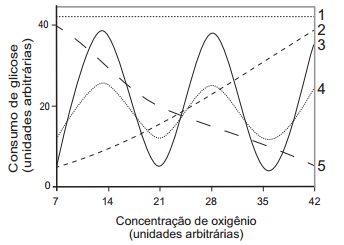

Normalmente, as células do organismo humano realizam a respiração aeróbica, na qual o consumo de uma mólecula de glicose gera 38 moléculas de ATP. Contudo em condições anaeróbicas, o consumo de uma mólecula de glicose pelas células é capaz de gerar apenas duas moléculas de ATP.

Qual curva representa o perfil de consumo de glicose, para manutenção da homeostase de uma célula que inicialmente está em uma condição anaeróbica e é submetida a um aumento grandual de concentração de oxigênio?

- [ ] 1
- [ ] 2
- [ ] 3
- [ ] 4
- [x] 5

Em condições anaeróbicas o consumo de glicose é alta porque ocorre, apenas, a produção de 2 ATP. O aumento progressivo na concentração de O2 reduz o consumo de glicose uma vez que a célula passa a produzir mais ATP (38 moléculas).
