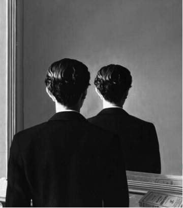

 

MAGRITTE, R. **A reprodução proibida**. Óleo sobre tela, 81,3 x 65 cm. Museum Boijmans Van Buningen, Holanda, 1937.

 

O Surrealismo configurou-se como uma das vanguardas artísticas europeias do início do século XX. René Magritte, pintor belga, apresenta elementos dessa vanguarda em suas produções. Um traço do Surrealismo presente nessa pintura é o(a)

 

- [x] justaposição de elementos díspares, observada na imagem do homem no espelho.
- [ ] crítica ao passadismo, exposta na dupla imagem do homem olhando sempre para frente.
- [ ] construção de perspectiva, apresentada na sobreposição de planos visuais.
- [ ] processo de automatismo, indicado na repetição da imagem do homem.
- [ ] procedimento de colagem, identificado no reflexo do livro no espelho.

O quadro de Magritte apresenta um disparate, um absurdo: a imagem de um espelho não reflete o rosto de quem se coloca à sua frente, mas reflete-o novamente de costas. Essa subversão da lógica convencional, valorizando o delírio, o nonsense, é um dos procedimentos típicos do Surrealismo.

        