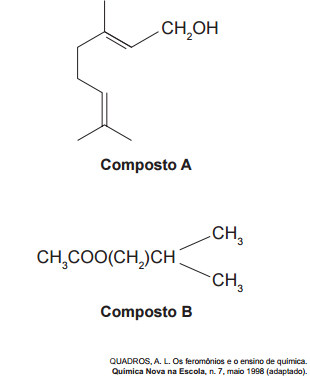
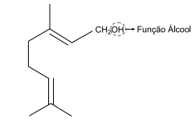
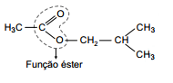

Uma forma de organização de um sistema biológico é a presença de sinais diversos utilizados pelos indivíduos para se comunicarem. No caso das abelhas da espécie Apis mellifera, os sinais utilizados podem ser feromônios. Para saírem e voltarem de suas colmeias, usam um feromônio que indica a trilha percorrida por elas (Composto A). Quando pressentem o perigo, expelem um feromônio de alarme (Composto B), que serve de sinal para um combate coletivo. O que diferencia cada um desses sinais utilizados pelas abelhas são as estruturas e funções orgânicas dos feromônios.

As funções orgânicas que caracterizam os feromônios de trilha e de alarme são, respectivamente,

- [x] álcool e éster.
- [ ] aldeído e cetona.
- [ ] éter e hidrocarboneto.
- [ ] enol e ácido carboxílico.
- [ ]  ácido carboxílico e amida.

A função orgânica que carcteriza o feromônio que indica a trilha percorrida pelas abelhas (composto A) é:

A função orgânica que carcteriza o feromônio de alarme quando pressentem o perigo (composto B) é:

 

        