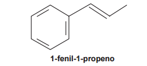
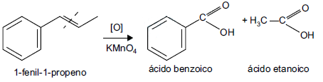

# q
O permanganato de potássio ($\ce{KMnO4}$) é um agente oxidante forte muito empregado tanto em nível laboratorial quanto industrial. Na oxidação de alcenos de cadeia normal, como o 1-fenil-1-propeno, ilustrado na figura, o KMnO4 é utilizado para a produção de ácidos carboxílicos.

Os produtos obtidos na oxidação do alceno representado, em solução aquosa de $\ce{KMnO4}$, são:

# a
Ácido benzoico e ácido etanoico.

# b
Ácido benzoico e ácido propanoico.

# c
Ácido etanoico e ácido 2-feniletanoico.

# d
Ácido 2-feniletanoico e ácido metanoico.

# e
Ácido 2-feniletanoico e ácido propanoico.

# r
a

# s
A oxidação do composto 1-fenil-1-propeno, na presença de permanganato de potássio (KMnO4) produz ácidos carboxílicos, segundo a equação:

