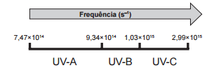
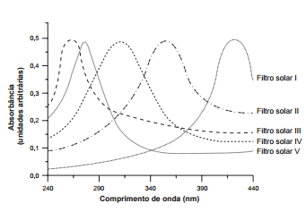

A radiação ultravioleta (UV) é dividida, de acordo com três faixas de frequência, em UV-A, UV-B e UV-C, conforme a figura.

Para selecionar um filtro solar que apresente absorção máxima na faixa UV-B, uma pessoa analisou os espectros de absorção da radiação UV de cinco filtros solares:

Considere: velocidade da luz = $3,0 \times 10^8\\, m/s$ e  $1\\,nm = 1,0 \times 10^{-9}\\,m$.

O filtro solar que a pessoa deve selecionar é o

- [ ] V
- [x] IV
- [ ] III
- [ ] II
- [ ] I

(I) Cálculo dos comprimentos de onda associados às frequências limítrofes do UV-B.

$c = \lambda f$

$\lambda = \cfrac{c}{f}$

$\lambda\_{mín} = \cfrac{c}{f\_{máx}} = \cfrac{3,0 \times 10^8}{1,03 \times 10^{15}}\\,m$

$\lambda\_{min} \approx 2,9 \cdot 10^{-7}$

$\lambda\_{mín} \approx 2,9 \cdot 10^{-7} \cdot 10^9 \\, nm$

**$\lambda\_{mín} \approx 290\\, nm$**

 

$\lambda\_{máx} = \cfrac{c}{f\_{mín}} = \cfrac{3,0 \cdot 10^8}{9,34 \cdot 10^{14}}\\, m$

$\lambda\_{máx} = 3,2 \cdot 10^{-7}\\, m$

$\lambda\_{máx} = 3,2 \cdot 10^{-7} \cdot 10^9\\, nm$

$\lambda \approx 320\\,nm$

(II) Os comprimentos de onda calculados remetem, no gráfico dado, à curva correspondente ao filtro solar IV, que apresenta absorção máxima entre 290 nm e 340 nm.
