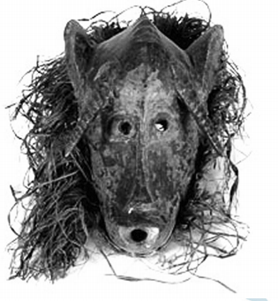

# q

**Máscara senufo**, Mati. Madeira e fibra vegetal. Acervo do MAE/USP.

 

As formas plásticas nas produções africanas conduziram artistas modernos do início do século XX, como Pablo Picasso, a algumas proposições artísticas denominadas vanguardas. A máscara remete à

# a
preservação da proporção.

# b
idealização do movimento.

# c
estruturação assimétrica

# d
sintetização das formas

# e
valorização estética.

# r
d

# s
A vanguarda europeia também se inspirou na arte africana, retomando a síntese e a expressividade de formas da arte tribal.
