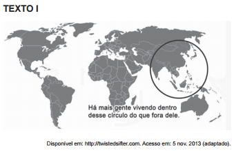

**TEXTO II**

A Índia deu um passo alto no setor de teleatendimento para países mais desenvolvidos, como os Estados Unidos e as nações europeias. Atualmente mais de 245 mil indianos realizam ligações para todas as partes do mundo a fim de oferecer cartões de créditos ou telefones celulares ou cobrar contas em atraso.

Disponível em: www.conectacallcenter.com.br. Acesso em: 12 nov. 2013 (adaptado).

Ao relacionar os textos, a explicação para o processo de territorialização descrito está no(a)

- [ ] aceitação das diferenças culturais.
- [ ] adequação da posição geográfica.
- [ ] incremento do ensino superior.
- [ ] qualidade da rede logística.
- [x] custo da mão de obra local.

O sudeste Asiático, área destacada no texto I, é a região mais populosa do planeta, fato que determina o barateamento da mão de obra na maioria dos países da região. A Índia, segundo país mais populoso do mundo, é uma referência mundial no setor de serviços de teleatendimento. Além disso, uma grande parcela da população fala inglês, o que facilita a comunicação com os Estados Unidos e as nações europeias.
