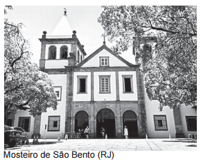
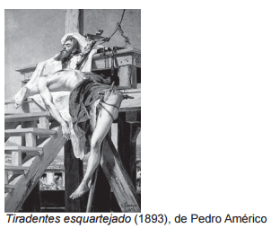
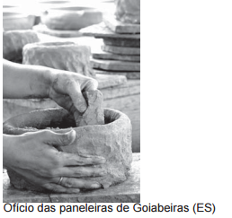
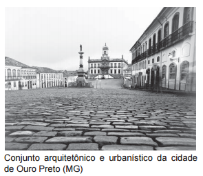
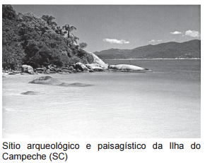

Queijo de Minas vira patrimônio cultural brasileiro

O modo artesanal da fabricação do queijo em Minas Gerais foi registrado nesta quinta-feira (15) como patrimônio cultural imaterial brasileiro pelo Conselho Consultivo do Instituto do Patrimônio Histórico e Artístico Nacional (Iphan). O veredicto foi dado em reunião do conselho realizada no Museu de Artes e Ofícios, em Belo Horizonte. O presidente do Iphan e do conselho ressaltou que a técnica de fabricação artesanal do queijo está “inserida na cultura do que é ser mineiro”.

Folha de S. Paulo, 15 maio 2008.

Entre os bens que compõem o patrimônio nacional, o que pertence à mesma categoria citada no texto está representado em:

- [ ] 
- [ ] 
- [x] 
- [ ] 
- [ ] 

Assim como a fabricação artesanal do queijo de Minas Gerais é patrimônio cultural imaterial brasileiro, o IPHAN considera o ofício das paneleiras de Goiabeiras (ES) patrimônio da mesma categoria.
