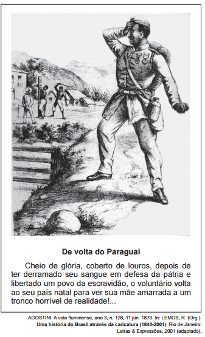

Na charge, identifica-se uma contradição no retorno de parte dos “Voluntários da Pátria” que lutaram na Guerra do Paraguai (1864-1870), evidenciada na

- [x] negação da cidadania aos familiares cativos
- [ ] concessão de alforrias aos militares escravos.
- [ ] perseguição dos escravistas aos soldados negros.
- [ ] punição dos feitores aos recrutados compulsoriamente.
- [ ] suspensão das indenizações aos proprietários prejudicados.

A charge de Angelo Agostini evidencia o choque de um negro liberto ao observar negros escravizados sendo agredidos. Esse contraste ocorria, pois os negros que combateram na guerra do Paraguai (1864-70) adquiriam sua liberdade, diferentemente de seus familiares, que continuavam escravizados. Vale lembrar ainda que a negação da cidadania aos familiares dos “voluntários da Pátria” reforçou a campanha abolicionista.
