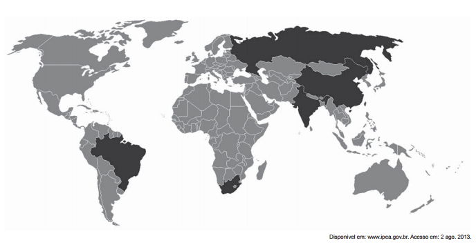

Na imagem, é ressaltado, em tom mais escuro, um grupo de países que na atualidade possuem características político-econômicas comuns, no sentido de

- [ ] adotarem o liberalismo político na dinâmica dos seus setores públicos.
- [ ] constituírem modelos de ações decisórias vinculadas à social-democracia.
- [x] instituírem fóruns de discussão sobre intercâmbio multilateral de economias emergentes.
- [ ] promoverem a integração representativa dos diversos povos integrantes de seus territórios.
- [ ] apresentarem uma frente de desalinhamento político aos polos dominantes do sistema-mundo.

O mapa destaca o grupo de países denominado BRICS (Brasil, Rússia, Índia, China e África do Sul), acrônimo criado em 2001, com a intenção de valorizar países emergentes que cresciam economicamente de forma destacada no cenário internacional. Esses países promovem uma série de encontros para desenvolver suas economias e a de outros países. Vale destacar a criação, em julho de 2014, do Banco dos BRICS, com aporte inicial de 50 bilhões de dólares, com o objetivo de financiar obras de infraestrutura em países pobres e emergentes
