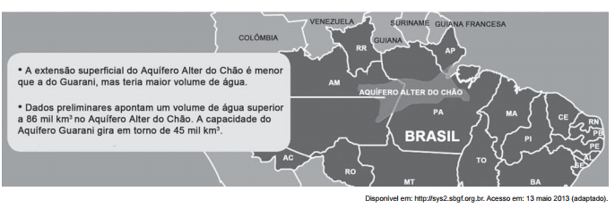

A preservação da sustentabilidade do recurso natural exposto pressupõe

- [ ] impedir a perfuração de poços.
- [ ] coibir o uso pelo setor residencial
- [ ] substituir as leis ambientais vigentes
- [ ] reduzir o contingente populacional na área.
- [x] introduzir a gestão participativa entre os municípios.

O Aquífero Alter do Chão é uma enorme reserva subterrânea com volume estimado em mais de 160 trilhões de m3 , valor 3,5 vezes maior do que o Aquífero Guarani. O conhecimento sobre esse importante reservatório ainda é muito restrito para avaliar a possibilidade de uso para abastecimento humano. Contudo, se isso for possível, faz-se necessário introduzir a gestão participativa entre os municípios do Amazonas, Pará e Amapá, estados onde o Aquífero está presente, para a preservação e a sustentabilidade desse recurso natural.
