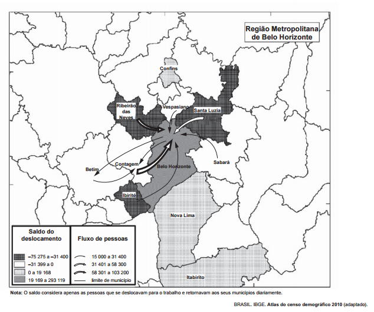

O fluxo migratório representado está associado ao processo de

- [ ] fuga de áreas degradadas.
- [ ] inversão da hierarquia urbana.
- [ ] busca por amenidades ambientais.
- [x] conurbação entre municípios contíguos.
- [ ] desconcentração dos investimentos produtivos.

A conurbação dos municípios das regiões metropolitanas está relacionada ao processo de saturação das regiões centrais acompanhado pela especulação imobiliária. Este processo colabora para a expansão das manchas urbanas, obrigando a população a realizar movimentos diários cada vez mais longos da moradia para o trabalho.

        