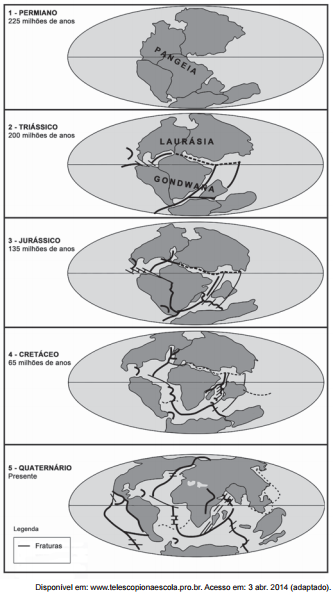

A partir da análise da imagem, o aparecimento da Dorsal Mesoatlântica está associada ao(à)

- [ ] separação da Pangeia a partir do período Permiano
- [ ] deslocamento de fraturas no período Triássico.
- [ ] afastamento da Europa no período Jurássico
- [x] formação do Atlântico Sul no período Cretáceo.
- [ ] constituição de orogêneses no período Quaternário.

Diferentes forças endógenas impulsionadas pela energia interna da Terra trazem um constante deslocamento de placas tectônicas, que formam a crosta terrestre. Tal movimentação fez com que surgissem diversas confgurações continentais e oceânicas em diferentes momentos da história geológica do planeta.

A existência da cadeia vulcânica conhecida como Dorsal Atlântica, localizada no interior do oceano de mesmo nome, é identificada no mapa que representa o período Cretáceo, momento em que a América do Sul e a África já se encontram bastante afastadas em decorrência da abertura do assoalho oceânico na faixa em que a Dorsal Atlântica se formou.
