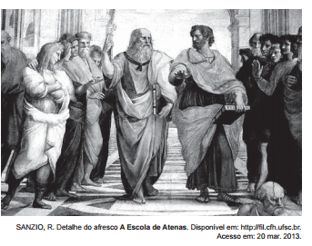

No centro da imagem, o filósofo Platão é retratado apontando para o alto. Esse gesto signifca que o conhecimento se encontra em uma instância na qual o homem descobre a

- [ ] suspensão do juízo como reveladora da verdade.
- [x] realidade inteligível por meio do método dialético.
- [ ] salvação da condição mortal pelo poder de Deus.
- [ ] essência das coisas sensíveis no intelecto divino.
- [ ] ordem intrínseca ao mundo por meio da sensibilidade.

No afresco de Rafael, o gesto platônico é tradicionalmente interpretado como uma referência à teoria do conhecimento de Platão, que afirma que o conhecimento verdadeiro exige a libertação das aparências do mundo sensível e uma ascese ao mundo das essências, ao universo inteligível. Esse universo, que transcende as experiências do mundo material, é atingido por meio do método dialético, do qual os diálogos platônicos são exemplo e comprovação.
