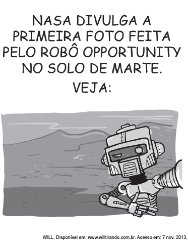

Opportunity é o nome de um veículo explorador que aterrissou em Marte com a missão de enviar informações à Terra. A charge apresenta uma crítica ao(à)

- [ ] gasto exagerado com o envio de robôs a outros planetas.
- [ ] exploração indiscriminada de outros planetas.
- [x] circulação digital excessiva de autorretratos.
- [ ] vulgarização das descobertas espaciais.
- [ ] mecanização das atividades humanas.

A charge opera com o mecanismo de humor; pois, em vez de imagens sobre as características físicas de Marte, tem-se uma selfie do robô, caracterizando, portanto, uma crítica à circulação digital excessiva de autorretratos.

        