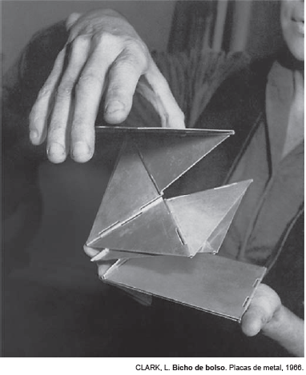

O objeto escultórico produzido por Lygia Clark, representante do Neoconcretismo, exemplifica o início de uma vertente importante na arte contemporânea, que amplia as funções da arte. Tendo como referência a obra Bicho de bolso, identifica-se essa vertente pelo(a)

- [x] participação efetiva do espectador na obra, o que determina a proximidade entre arte e vida.
- [ ] percepção do uso de objetos cotidianos para a confecção da obra de arte, aproximando arte e realidade.
- [ ] reconhecimento do uso de técnicas artesanais na arte, o que determina a consolidação de valores culturais.
- [ ] reflexão sobre a captação artística de imagens com meios óticos, revelando o desenvolvimento de uma linguagem própria.
- [ ] entendimento sobre o uso de métodos de produção em série para a confecção da obra de arte, o que atualiza as linguagens artísticas.

Uma das propostas básicas do Neoconcretismo consistia na procura de novos suportes para a expressão artística, fugindo aos limites convencionais da tela. O trabalho de Lygia Clark com placas de metal se insere nessa tendência. Além disso, os neoconcretos tentavam escapar do espaço tradicional dos museus, pois buscavam uma interação maior com o público.

        