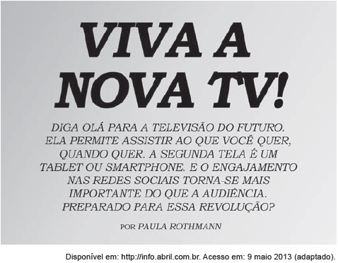

O texto introduz uma reportagem a respeito do futuro da televisão, destacando que as tecnologias a ela incorporadas serão responsáveis por

- [ ] estimular a substituição dos antigos aparelhos de TV.
- [x] contemplar os desejos individuais com recursos de ponta.
- [ ] transformar a televisão no principal meio de acesso às redes sociais.
- [ ] renovar técnicas de apresentação de programas e de captação de imagens.
- [ ] minimizar a importância dessa ferramenta como meio de comunicação de massa.

A propaganda mostra que a nova TV permite ao espectador não só selecionar aquilo a que deseja assistir, mas também o momento em que irá fazê-lo. Além disso, ela funciona também como tablet ou smartphone, permitindo o acesso às redes sociais. Essa nova TV, portanto, contempla os desejos individuais por meio de recursos de ponta.
